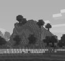
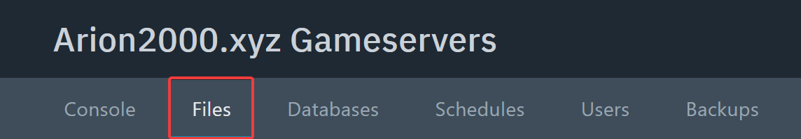
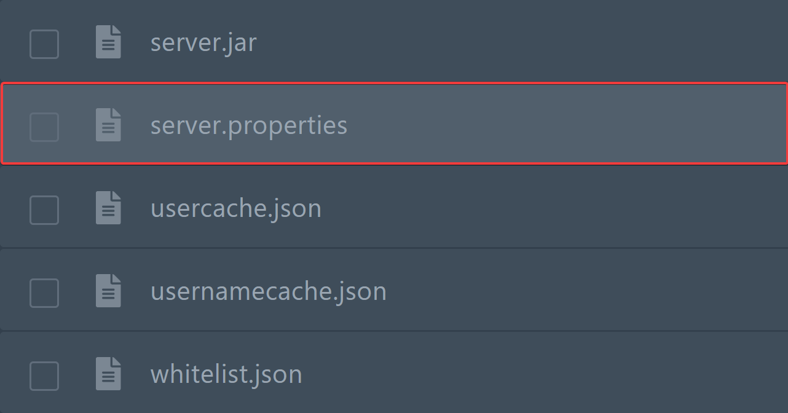
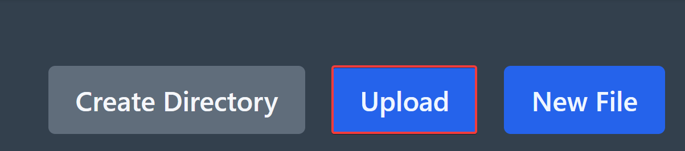

import Tabs from '@theme/Tabs';
import TabItem from '@theme/TabItem';

# Design in der Serverliste anpassen

Du findest, dass dein Server vor dem Betreten in der Serverliste aktuell noch etwas langweilig aussieht?

Besonders das Bild auf der linken Seite?



**Das kann man ganz einfach ändern!**
<Tabs>
  <TabItem value="open_change_description_tutorial" label="Serverbeschreibung ändern" default>
:::note[Notiz]

Die Serverbeschreibung (der Text unter dem Servernamen) wird häufig auch **MOTD** genannt. Die Abkürzung steht für *"Message of the day"*.

:::

Um die Serverbeschreibung zu ändern, musst du [**im Panel**](https://panel.arion2000.xyz/ "Klicke hier, um das Panel aufzurufen") deinen Server auswählen, und oben in den Tab **Files** wechseln.



Suche dann nach der **Datei `server.properties`** und öffne diese, indem du auf sie klickst.



Finde nun die folgende Zeile in der Datei:

```properties
motd=A Minecraft Server
```

:::tip[Tipp]
Du kannst auch **STRG + F** verwenden, um etwas in einer Datei zu finden.
:::

**Passe diesen Text an**, um die Serverbeschreibung zu ändern. Du kannst auch die **Minecraft Farb- und Formatierungscodes** verwenden. Weitere Infos findest du [hier](./minecraft-color-codes). 

**Speichere** anschließend die Datei und **starte den Server neu**, um die Einstellungen anzuwenden.

  </TabItem>
  <TabItem value="open_change_icon_tutorial" label="Servericon ändern">
:::warning[Wichtig]
Dein neues Servericon sollte im **PNG-Format** vorliegen und **exakt 64x64 Pixel** groß sein.
:::

Nun musst du das neue Servericon **[im Panel](https://panel.arion2000.xyz/ "Klicke hier, um das Panel aufzurufen")** unter **Files** hochladen.


Anschließend kannst du die Datei über **Upload** hochladen.



:::important[Wichtig]
Falls es noch nicht der Fall ist, musst du deine Datei anschließend zu **`server-icon.png` (genaue Schreibweise wichtig)** umbenennen. Mache hierzu entweder einen Rechtsklick auf die Datei oder klicke rechts auf die 3 Punkte und wähle **Rename** aus. Gib dann `server-icon.png` ein und klicke rechts erneut auf den blauen Button **Rename**.
:::

**Starte nun den Server neu** und das neue Servericon sollte erscheinen.
  </TabItem>
</Tabs>

---

:::tip[Tipp]
**Falls es Probleme gibt**, suche in der **Konsole** oder den **Logdateien nach Fehlern** oder **kontaktiere den [Support](mailto:tickets@arion2000.xyz)**.
:::
