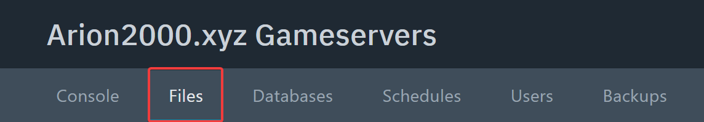
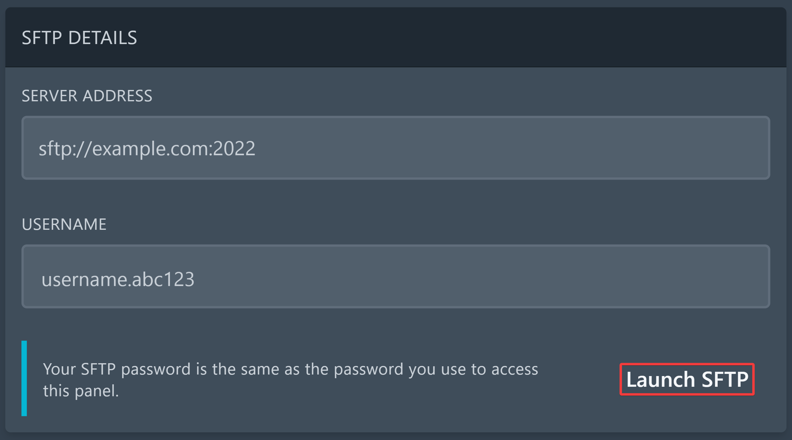

import Tabs from '@theme/Tabs';
import TabItem from '@theme/TabItem';

# Welt hochladen

Falls du bereits eine Singleplayer-Welt oder eine Welt von einem anderen Server hast, die du auf deinem Server verwenden möchtest, kannst du sie ganz einfach hochladen. Auf dieser Seite wird dir Schritt für Schritt erklärt, wie du das tun kannst.

## Welt auf Vanilla- oder Fabric-Server hochladen

1. Öffne den Datei-Explorer und wechsle in das Verzeichnis deiner Minecraft-Installation auf deinem Computer. Standardmäßig ist das `%appdata%/.minecraft`.

2. Öffne den `saves`-Ordner und finde die Welt, die du auf den Server hochladen möchtest.

<Tabs>
    <TabItem value="open_upload_via_panel" label="Über das Panel hochladen" default>
    3. Da das Panel das Hochladen von ganzen Ordnern aktuell noch nicht unterstützt, musst du deinen **Weltenordner zuerst in eine ZIP-Datei komprimieren**. 

    4. Wechsle im Panel in den Tab **Files**.

    

    5. Lade die ZIP-Datei über den **Upload**-Knopf hoch.

    

    6. Mache einen Rechtsklick auf die hochgeladene ZIP-Datei und klicke auf **Unarchive**.

    7. Nachdem der Weltenordner auf dem Server entpackt wurde, kannst du die ZIP-Datei wieder löschen.

    8. Falls der Name des Weltenordners **nicht** `world` ist, hast du zwei Möglichkeiten:
        - Entweder machst du einen Rechtsklick auf den Weltenordner und wählst **Rename** aus, um den Ordner zu `world` umzubenennen.
        - Oder du öffnest die `server.properties`-Datei und änderst `level-name` zu dem Namen des Weltenordners (vergiss nicht, zu speichern!):

        ```properties title="server.properties"
        level-name=Name des Weltenordners
        ```

    9. Falls nötig, starte deinen Server neu.
    </TabItem>
    <TabItem value="open_upload_via_ftp" label="Über einen FTP-Client hochladen">
    3. Falls du noch keinen FTP-Client installiert hast, solltest du einen installieren. Wir empfehlen [WinSCP](https://winscp.net/eng/download.php).

    4. Wechsle im Panel in den Tab **Settings** und klicke auf **Launch SFTP**. Falls dein Browser fragt, ob WinSCP automatisch geöffnet werden soll, kannst du dem zustimmen.

    

    5. WinSCP fragt dich nach einem Passwort. Dieses ist das selbe, das du auch für die Anmeldung im Panel verwendest.

    6. Wenn du verbunden bist, ziehe einfach den Weltenordner, den du hochladen möchtest, in das WinSCP Fenster auf der rechten Seite. Der Ordner wird dann hochgeladen. 

    7. Falls der Name des Weltenordners **nicht** `world` ist, hast du zwei Möglichkeiten:
        - Entweder machst einen Rechtsklick auf den Weltenordner und wählst **Umbenennen** aus, um den Ordner zu `world` umzubenennen.
        - Oder du öffnest die `server.properties`-Datei und änderst `level-name` zu dem Namen des Weltenordners (vergiss nicht, zu speichern!):

        ```properties title="server.properties"
        level-name=Name des Weltenordners
        ```

    8. Falls nötig, starte deinen Server neu.
    </TabItem>
</Tabs>

Jetzt sollte die neue Welt auf deinem Server vorhanden sein. Falls es Probleme gibt, versuche die Ordner `.cache` und `libraries` zu löschen und starte den Server erneut neu.

Alternativ kannst du auch [unseren Support](mailto:tickets@arion2000.xyz) um Hilfe bitten.

## Welt auf Paper- oder Purpur-Server hochladen


1. Öffne den Datei-Explorer und wechsle in das Verzeichnis deiner Minecraft-Installation auf deinem Computer. Standardmäßig ist das `%appdata%/.minecraft`.

2. Öffne den `saves`-Ordner und finde die Welt, die du auf den Server hochladen möchtest.

3. Paper und Purpur verwenden eine etwas andere Ordnerstruktur, als es in Vanilla-Minecraft der Fall ist. Deshalb musst du neben dem originalen Weltenordner, der schon da ist, noch 2 weitere Ordner erstellen:

| Version         | Overworld | Nether                | End                   |
| --------------- | --------- | --------------------- | --------------------- |
| Vanilla         | `/world`  | `/world/DIM-1`        | `/world/DIM1`         |
| Paper & Purpur  | `/world`  | `/world_nether/DIM-1` | `/world_the_end/DIM1` |

    - Erstelle also einen `world_nether`-Ordner und einen `world_the_end`-Ordner.
    - Verschiebe dann den `DIM-1`-Unterordner aus dem originalen Weltenordner in den `world_nether`-Ordner und den `DIM1`-Unterordner in den `world_the_end`-Ordner.

<Tabs>
    <TabItem value="open_upload_via_panel" label="Über das Panel hochladen" default>
    4. Da das Panel das Hochladen von ganzen Ordnern aktuell noch nicht unterstützt, musst du deinen **Weltenordner zuerst in eine ZIP-Datei komprimieren**. 

    5. Wechsle im Panel in den Tab **Files**.

    

    6. Lade die ZIP-Datei über den **Upload**-Knopf hoch.

    

    7. Mache einen Rechtsklick auf die hochgeladene ZIP-Datei und klicke auf **Unarchive**.

    8. Nachdem der Weltenordner auf dem Server entpackt wurde, kannst du die ZIP-Datei wieder löschen.

    9. Falls der Name des Weltenordners **nicht** `world` ist, hast du zwei Möglichkeiten:
        - Entweder machst du einen Rechtsklick auf den Weltenordner und wählst **Rename** aus, um den Ordner zu `world` umzubenennen.
        - Oder du öffnest die `server.properties`-Datei und änderst `level-name` zu dem Namen des Weltenordners (vergiss nicht, zu speichern!):

        ```properties title="server.properties"
        level-name=Name des Weltenordners
        ```

    10. Falls nötig, starte deinen Server neu.
    </TabItem>
    <TabItem value="open_upload_via_ftp" label="Über einen FTP-Client hochladen">
    4. Falls du noch keinen FTP-Client installiert hast, solltest du einen installieren. Wir empfehlen [WinSCP](https://winscp.net/eng/download.php).

    5. Wechsle im Panel in den Tab **Settings** und klicke auf **Launch SFTP**. Falls dein Browser fragt, ob WinSCP automatisch geöffnet werden soll, kannst du dem zustimmen.

    

    6. WinSCP fragt dich nach einem Passwort. Dieses ist das selbe, das du auch für die Anmeldung im Panel verwendest.

    7. Wenn du verbunden bist, ziehe einfach den Weltenordner, den du hochladen möchtest, in das WinSCP Fenster auf der rechten Seite. Der Ordner wird dann hochgeladen. 

    8. Falls der Name des Weltenordners **nicht** `world` ist, hast du zwei Möglichkeiten:
        - Entweder machst einen Rechtsklick auf den Weltenordner und wählst **Umbenennen** aus, um den Ordner zu `world` umzubenennen.
        - Oder du öffnest die `server.properties`-Datei und änderst `level-name` zu dem Namen des Weltenordners (vergiss nicht, zu speichern!):

        ```properties title="server.properties"
        level-name=Name des Weltenordners
        ```

    9. Falls nötig, starte deinen Server neu.
    </TabItem>
</Tabs>

Jetzt sollte die neue Welt auf deinem Server vorhanden sein. Falls es Probleme gibt, versuche die Ordner `.cache` und `libraries` zu löschen und starte den Server erneut neu.

Alternativ kannst du auch [unseren Support](mailto:tickets@arion2000.xyz) um Hilfe bitten.
